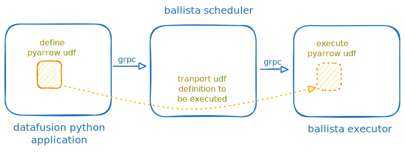

# Ballista (Datafusion )Python Support

Make [Datafusion Ballista](https://github.com/apache/datafusion-ballista) support [Datafusion Python](http://github.com/apache/datafusion-python) and shipping pyarrow UDFs to remote task contexts.

> [!IMPORTANT]
> This is just a showcase project and it is not meant to be maintained.

This project tests validity of [datafusion-python/1003](https://github.com/apache/datafusion-python/pull/1003).



## Environment Setup

```bash
pyenv local 3.12
python3 -m venv .venv
source .venv/bin/activate
pip3 install -r requirements.txt
```

Start [scheduler](examples/scheduler.rs) and [executor](examples/executor.rs).

## Datafusion Python Ballista Integration

[Patched branch](https://github.com/milenkovicm/datafusion-python/tree/poc_ballista_support) of datafusion-python is needed.

A simple script will execute on ballista cluster:

```python
from datafusion import SessionContext, udf, functions as f
import pyarrow.compute as pc
import pyarrow

# SessionContext with url specified will connect to ballista cluster
ctx = SessionContext(url = "df://localhost:50050")

# arrow udf definition
def to_miles(km_data):
    conversation_rate_multiplier = 0.62137119
    return pc.multiply(km_data, conversation_rate_multiplier)    

# datafusion udf definition 
to_miles_udf = udf(to_miles, [pyarrow.float64()], pyarrow.float64(), "stable")

# its incorrect to convert passenger_count to miles
df = df.select(to_miles_udf(f.col("passenger_count")), f.col("passenger_count"))

# show data 
df.show()
```

Note: if notebook complains about `cloudpickle` please `!pip install` it, did not have time to find out how to specify it as a dependency.

## Run Datafusion Python

[rust client](examples/client.rs) can wrap and execute python scrip:

```rust
    let ctx = SessionContext::remote_with_state("df://localhost:50050", state).await?;

    let code = r#"
import pyarrow.compute as pc
def udf(km_data):
    conversation_rate_multiplier = 0.62137119
    return pc.multiply(km_data, conversation_rate_multiplier)    
"#;

    let udf = PythonUDF::from_code("to_miles", code).expect("udf created");
    let udf = ScalarUDF::from(udf);

    ctx.read_parquet("./data/alltypes.parquet", ParquetReadOptions::default())
        .await?
        .select(vec![udf.call(vec![lit(1.0) * col("id")])])?
        .show()
        .await?;

```

should produce:

```text
+-----------------------------------+
| to_miles(Float64(1) * ?table?.id) |
+-----------------------------------+
| 2.48548476                        |
| 3.10685595                        |
| 3.7282271399999996                |
| 4.34959833                        |
...
+-----------------------------------+
```

## Implementation Internals

Project creates a custom logical (`PyLogicalCodec`) and physical (`PyPhysicalCodec`) codecs which handle serialization and deserialization of python functions using [cloudpickle](https://github.com/cloudpipe/cloudpickle) library.

Custom codecs are registered on `SessionContext` creation:

```rust
let config = SessionConfig::new_with_ballista()
        .with_ballista_logical_extension_codec(Arc::new(PyLogicalCodec::default()))
        .with_target_partitions(4);

let state = SessionStateBuilder::new()
    .with_config(config)
    .with_default_features()
    .build();

let ctx = SessionContext::remote_with_state("df://localhost:50050", state).await?;
```
